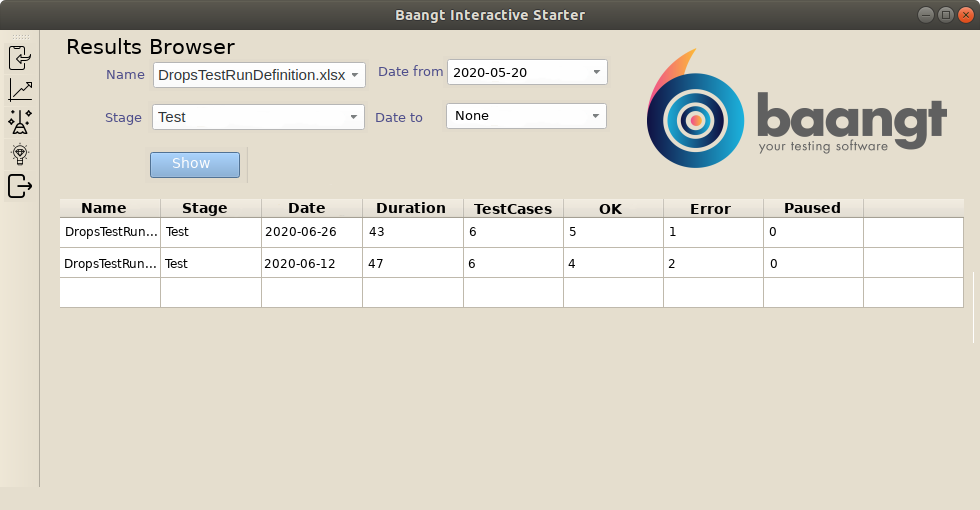

Results Browser
===============
**Results Browser** is a `baangt` feature that allows to view the results of the completed TestRuns from the database. It comprises two modules: 
* *ResultQuery.py* -- the back-end module
* *ResultsBrowser.py* -- the front-end module

ResultsQuery.py
---------------
**_ResultsQuery.py_** implements the back-end of the *Results Browser* feature. Its main functionality includes the follow:
* make queries to the database
* return the query results as a `dict` object that is handy to show/visualize

### Queries
* summary on a particular test run:
  * name
  * stage
  * execution date
  * number of all/successful/failed/paused test cases
  * test run duration
  * duration and execution status of the test cases within the test run
  * path to logfile
  * path to results file  

* summary on a set of test runs:
  * name
  * stage
  * execution date
  * test run duration
  * average test run duration (for sets defined by both name and stage)
  * average duration of the test cases within the TestRun (for sets defined by both name and stage)

  the variants of the sets:
  * all
  * filtered by name
  * filtered by stage
  * filtered by name and stage
  * all above within a certain time gap

* test case status history of a TestRun executed on a certain stage (shows how often and which test case within a TestRun was executed OK (and when) and how often it failed)
* test case duration history of a TestRun executed on a certain stage

ResultsBrowser.py
-----------------
**_ResultsBrowser.py_** implements the front-end (GUI) of the *Results Browser* feature. It extends the current `baangt` GUI with additional screen.

