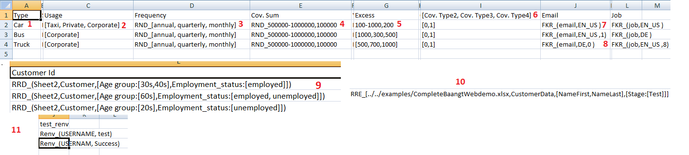

DataGenerator
=============

When we work with ``baangt`` to perform various tasks, we need to give excel file containing all data as input.
Sometimes this data can be too big and can be a huge headache when one has to type all these manually. To overcome this
issue we had made an application which can generate all possible data combinations by just providing and small excel file
containing all data.

Input File
==========

This image is an example input file. Different types of data types supported are given different number in the above image.
1. Is a simple value.
2. Is a list of value.
3. Is a list of value with "RND_" prefix. We will learn more on it further.
4. RND_1,10,2 "RND_" prefix is also used here but with a range.
5. Simple range.
6. List of header.
7. "FKR_" keyword is used here.
8. "FKR_" keyword is used here with a new integer value 0 in end.

Using these data type we will generate all possible values.
Here is a simple example with simple value and value of list.

Example Input:-

vehicle, seats
car, [2,4,5]
bus, 60

Example Output:-

vehicle, seats
car, 2
car, 4
car, 5
bus, 60

As you can see that the output file contains every possible combination of input file. Further you will learn more about
Data Types in next section.

Data Type
=========

We will use the reference of above image and assigned number to learn about it in detail.
1. It is a simple single value.
2. It is a list of values which will be further used to create all possible combinations as shown in above example.
   Format = [value1, value2, value3]
3. Here comes a prefix. "RND_" is a prefix which is used when we don't need to create all possible combinations from a list
   and have to use any one of the data from the list whenever new data is generated. So it will not increase number as it
   is not compulsory to use all value.
4. Range is a new data type. It is used when we want to create a list of number with all of them having same gap between
   them.
   Format = Starting-Ending,Step
   Example input = 2-40,4   ||   Output = [2, 6, 10, 14, 18, 22, 26, 30, 34, 38]
   As shown in example, instead of writing whole list we can just use Range. In our example range is used with "RND_" so
   after creating this list random function will come into effect.
5. As explained in point 4.
6. List of header. When there are multiple headers which have same value inside them, then we can simply write a list of
   header in a single cell. Then the program will consider each value as an individual header and each of them will have
   the same below data.
   Example:
   header1, [header2,header3]
   value1 , value2
   output:
   header1, header2, header3
   value1 , value2 , value2
7. "FKR_" is another prefix used to generate fake data. It uses the faker module of python the generate the fake data.
   format = FKR_(type, locale)
   Note:- We use tuple with FKR_ prefix
   Example = FKR_(email, EN_US)
   In our example we used type = email as we want to get fake emails. EN_US is a locale which will make sure that email
   should be of same words of that language. By default this will create list of 5 fake emails, if you want to change default
   number of 5 you can add that number in the end of tuple.
   Example:- FKR_(email, EN_US, 8)
   Now this will generate list of 8 fake email and on every data any random email would be selected.
8. Now what if we don't want to create a list of email instead we want new mail for every data generated. For this we can
   simply use 0 number at the position of list length.
   Example:- FKR_(email, EN_US, 0)
   Now this will generate new email for every data in the output.

All Data Types Format
=====================
1. Value             = value
2. list of values    = [val1,val2]
3. range             = start-end,step
4. random            = RND_[list]
5. random from range = RND_start-end,step
6. List of header    = [title1, title2, title3]
7. Faker Prefix      = FKR_(type, locale, number_of_data)