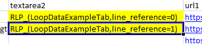
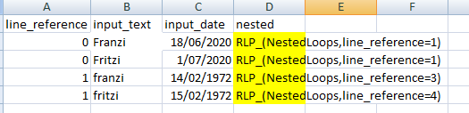
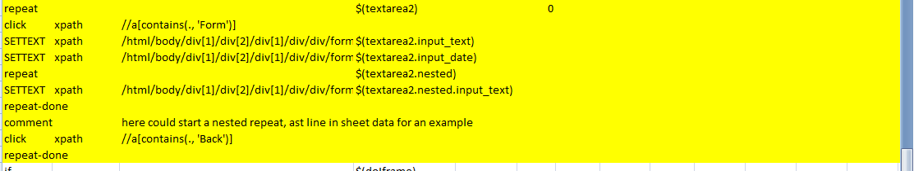

***********
NestedLoops
***********
While working on different TestCases we might need to repeat some TestSteps with a set of data and data might be big.
To counter this repeat issue we have ``REPEAT`` & ``REPEAT-DONE`` activity tags, everything between this two tags will
go on a loop. And to counter big & complex data structure we have ``RLP_`` prefix which will take written in another
sheet, hence it will be much easier to enter and maintain data in whole sheet rather than a tab.

RLP
===
``RLP_`` is a prefix which is used in data sheet. Its structure is ``RLP_(sheetName, lineReference=Number)`` here
sheetName will hold the name of sheet where main data is stored. LineRefernce holds the header name of the column which
contains Reference Number in target sheet, with the help of this reference number a list of data matching same reference
number is made which is then looped inside ``REPEAT`` loop. We can even use ``RLP_`` statement in a sheet previously
targeted by an other ``RLP_`` prefix. Hence, we can create a nested data and the data called by another ``RLP_`` data
will become its child and the caller become its parent.

Here in image_1 inside ``RLP_`` LoopDataExampleTab is the sheetName of the target sheet containing main data and
line_reference is the header which we are looking inside targetSheet, you can also see the header in image_2 which is of
targetSheet. Then the value of header is matched. Like in first ``RLP_`` data value of line_reference is 0, which means
it will create a list of data matching same in targetSheet, in this case their are 2 matching data so repeat statement
will execute one after another.

Repeat
======
``REPEAT`` tag is used in testrun file. It must be written inside "Activity" header and along with it, reference to the
node referring to the data must be written inside "Value" tag. Format of node must be ``$(parent)`` we have to replace
parent with the header name where rlp data is stored. In image_1 we can see "textarea2" is the header containing main
data, so it will look like ``($textarea2)``. Now, if need to use child node we can use ``$(parent.child)`` here child is
the name of header of the sheet which is replaced by ``RLP_`` prefix. In image_2 we can see their is "input_text" header
the sheet in image_2 replaces ``RLP_`` data of image_1 so it will look like ``$(textarea2.input_text)``. This node will
be replaced by the value inside input_text and a loop will start on all the matching line_reference. And lastly we have
a option to choose number of times loop is run. When we have a large number of data and we don't need to run loop on all
we can input number in value2 tab, then the loop will be run on the same number of randomly selected data. If we
want to run loop on all data we can simply leave the value2 tab empty or put 0. Also remember we need to use
``REPEAT-DONE`` at the other point of the loop (i.e. from where we need to run again from the starting of the loop.
Please see below image for further reference.

