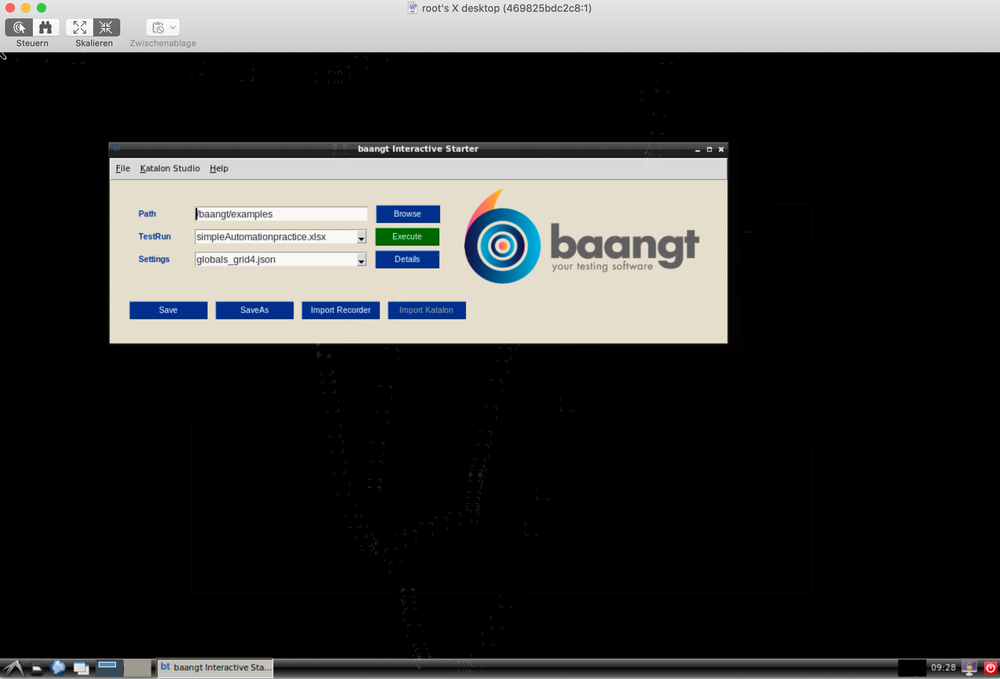
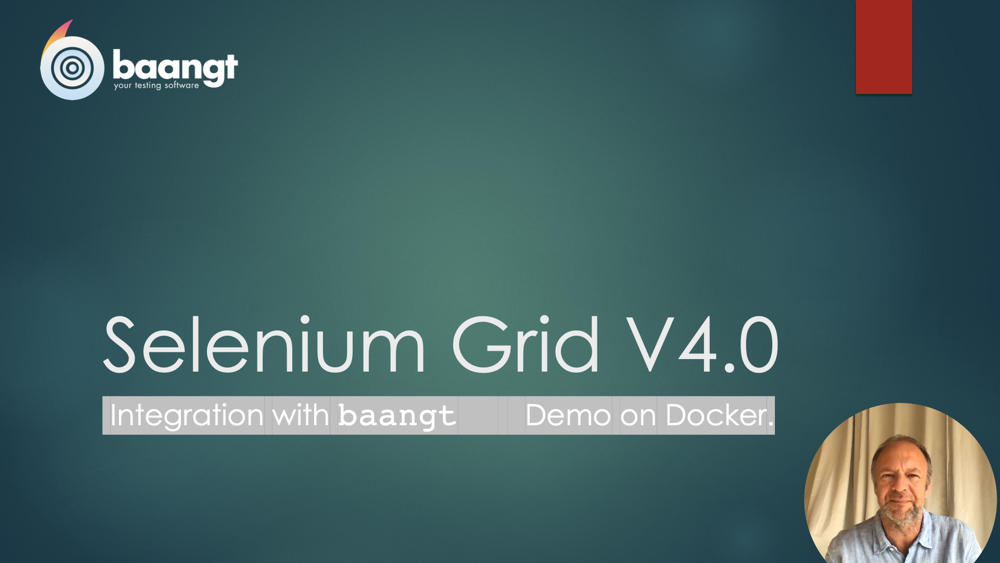

Integration with Selenium Grid V4
=================================

`baangt <https://baangt.org>`_ has now integration with `Selenium Grid V4 <https://github.com/SeleniumHQ/selenium/wiki/Selenium-Grid-4>`_.

Following the same logic as with integration of `Zalenium <https://github.com/zalando/zalenium>`_ and current
version of `Selenium Grid <https://www.guru99.com/introduction-to-selenium-grid.html>`_ you can define your test cases
and test data definitions in Microsoft Excel using simpleFormat, full Format or subclassed TestStepMaster.

The only difference is setting the Browser to ``REMOTE_V4``. Of course you'll need to provide address and port of the
service in ``BrowserAttributes``.

Ready for your own tests
------------------------

Even if you don't have a shiny Selenium Grid V4 Cluster on your own, you can simulate it using our Docker image. Just
download the `repository <https://gogs.earthsquad.global/athos/baangt-Docker-SeleniumGrid4>`_, e.g. by using ``git clone``.
Once it's downloaded use ``make build`` and ``make run`` to build and run the container. ``vnc://localhost:5902`` will
grant access to the Desktop inside the container.

Step by step instructions on video
----------------------------------

If you prefer to see a video with details on how to run and test ``baangt`` with Selenium Grid, head over to our youtube
channel: https://youtu.be/hpY9E-t55q4

