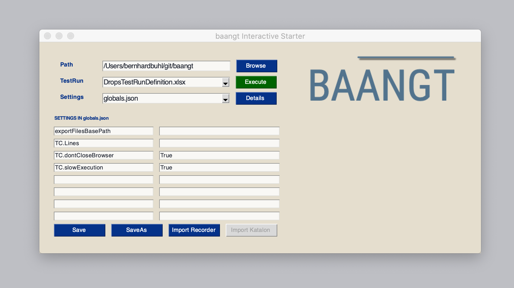

.. baangt documentation master file, created by
   sphinx-quickstart on Wed Jan 22 20:01:05 2020.
   You can adapt this file completely to your liking, but it should at least
   contain the root `toctree` directive.

Welcome to ``baangt``!
==================================
``baangt`` is the new, open source test suite, that grows along with your requirements. From simple recoding based automation to
highly complex corporate environments: ``baangt`` is the solution. And if it's not, it should be very easy to extend the solid
and well documented master functionality.

.. toctree::
   :maxdepth: 2
   :caption: Contents:

      Installation <Installation.rst>
      Overview <OverviewUsage.rst>
      First Steps <simpleExample.rst>
      Structure <Structure.rst>
      Parameters <ParametersConfigFile.rst>
      Data file <DataFile.rst>
      Types of Tests <TestTypes.rst>
      For Developers <Developer.rst>
      History <HistoryAndReasons.rst>
      Contributions <contributors.rst>
      Changelog <changelog.rst>
      Planned Features <PlannedFeatures.rst>

Indices and tables
==================

* :ref:`genindex`
* :ref:`modindex`
* :ref:`search`
